# MorphoHDL: a minimalistic language for growing circuits

Author: [Alexander Mordvintsev](https://znah.net/) ([Paradigms of Intelligence](https://github.com/paradigms-of-intelligence), Google)

## Introduction

This article describes MorphoHDL, an attempt to design a minimalistic yet expressive Hardware Description Language (HDL) built around the idea of recursive division and rewiring of cell definitions. It can be viewed as a graph rewrite system with the following properties:

* **Graph nodes** are functional cells with indexed input and output ports, and **edges** are buses carrying a variable number of wires.  

* **Cells** define rewrite rules: a single node is replaced by a set of subcells, which are then wired to one another and to the parent cell's inputs and outputs.

* **Cells are size-agnostic.** This is achieved through recursive splitting and merging of buses and routing them to subcells, combined with a fallback mechanism that stops recursion when the bus width can no longer be divided, an out-of-bounds bit is accessed, or a gate is instantiated with an empty input bus.

Thus, rather than introducing entirely new formalisms, MorphoHDL can be viewed as a practical instance of Parametric L-Systems [[6]](#references), where the hierarchical tree of cell lineage generates general graphs by inheriting lateral connections. In this article, however, we focus exclusively on feedforward (combinational) circuits. Sequential circuits are also possible with only a light language extension and are planned for the future.

Originally, the language was intended for implementing classical digital circuits like adders or multipliers. Later, I realized it could also be used to describe complex, organic structures. Its functional style and reliance on recursion make this language a lightweight cousin of frameworks like Lava [[1]](#references), CLaSH [[2]](#references), Chisel [[3]](#references), or Amaranth HDL. The core idea itself is not new: it is simply structural recursion pushed to its logical extreme.

> **Note:** MorphoHDL is currently a conceptual sketch rather than a complete, production-ready system. Think of it as an early-stage prototype; its syntax, features, and primitive library are subject to change in future iterations (see the [Future directions](#conclusion-and-future-directions) section for details).

<details><summary>More on motivation and boxes inside boxes...</summary>

Modern Systems-on-Chips (SoCs) manage complexity through strict hierarchical abstraction—grouping gates into cells, arithmetic units, computing cores, and eventually complete chips. In standard HDLs (like Verilog or SystemVerilog), designers must manually describe and connect these nested boundaries. In contrast, functional HDLs (such as Lava [[1]](#references)) leverage structural recursion to programmatically generate and scale these hierarchies with mathematical precision.

However, the actual chip implementation process still follows a rigid waterfall paradigm: logic is synthesized into an abstract netlist, mapped to physical components, and finally placed and routed. This workflow creates a critical disconnect. Synthesis tools make logical decisions (like selecting adder topologies) without knowing how the gates will be arranged. In modern sub-micron processes, wire delays and routing congestion dominate performance, forcing designers into long, unpredictable timing-closure loops where layout issues require re-synthesizing the logic from scratch.

Exploring solutions to this timing-closure loop is one of the core motivations behind MorphoHDL. While fully coupled morphological synthesis remains a future challenge, MorphoHDL takes a step toward this vision by growing the physical geometry and logical structure concurrently. Although logic connectivity is not layout-dependent in the current prototype, we envision a future where physical proximity directly influences or determines logical connections. In this ultimate view, the circuit behaves like a digital organism whose physical form and logical connections evolve together under local structural constraints.

</details>

## Classical boolean circuits

### Ripple-carry adder

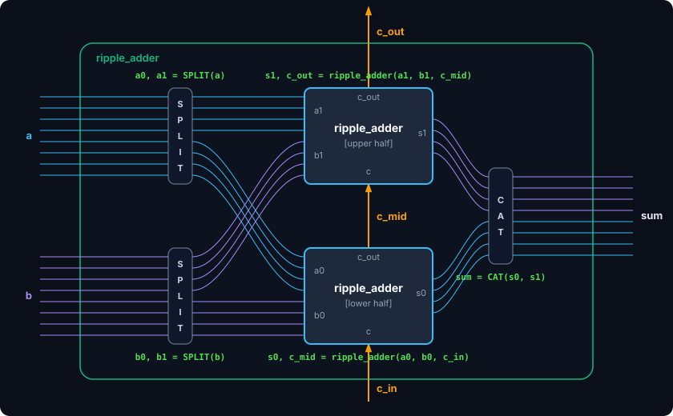
<p class="figure-caption">
  <strong>Recursive Ripple-Carry Adder.</strong> 
  An N-bit ripple adder constructed recursively by splitting operands into two N/2-bit halves and combining their carry and sum outputs.
</p>

Let's start with a simple example: creating a ripple-carry adder using MorphoHDL. I am using Python syntax for convenience and to avoid having to build a custom syntax highlighter, but it is better to think of it as a kind of dataflow-style Verilog—with the key difference that input/output bus sizes are never specified and are instead inferred dynamically at cell instantiation.

```python
# Define basic building blocks (Lookup Tables) for later usage.
# We allow primitives with >2 inputs because this more closely
# reflects the reality of modern VLSI, where a standard cell can
# be as complex as a full-adder or a 4-way multiplexer.

Not  = LUT(1, 0b01)
And  = LUT(2, 0b1000)
Or   = LUT(2, 0b1110)
Xor  = LUT(2, 0b0110)
Xor3 = LUT(3, 0b1001_0110)      # 3-input XOR (odd parity) for Sum
Maj3 = LUT(3, 0b1110_1000)      # 3-input Majority logic for Carry Out

@morpho                         # Base case cell (1-bit full adder)
def full_adder(a, b, c_in):     # a: [1], b: [1], c_in: [1] -> sum: [1], c_out: [1]
    sum = Xor3(a, b, c_in)
    c_out = Maj3(a, b, c_in)
    return sum, c_out

@morpho(fallback=full_adder)    # Recursive definition (falls back to full_adder at width 1)
def ripple_adder(a, b, c):      # a: [N], b: [N], c: [1] -> sum: [N], c_out: [1]
    a0, a1 = SPLIT(a)           # Split input buses into lower/upper halves
    b0, b1 = SPLIT(b)           # or trigger fallback when bus size is <2
    s0, c_mid = ripple_adder(a0, b0, c)       # Solve lower bits, extract mid carry
    s1, c_out = ripple_adder(a1, b1, c_mid)   # Solve upper bits with mid carry
    sum = CAT(s0, s1)           # Concatenate lower/upper sums back together
    return sum, c_out
```

The only control flow mechanism available in MorphoHDL is the `fallback` mechanism. If a cell or subcell fails to instantiate (such as when attempting to `SPLIT` a single-wire bus), the compilation process unwinds the fallback chain until it finds a cell that successfully instantiates. As a result, a single-bit `ripple_adder` automatically falls back to a 1-bit `full_adder`, which shares the same signature. This code automatically handles arbitrary (not necessarily power-of-two) input sizes, provided that `len(a) == len(b)` and that `SPLIT` consistently routes the middle wire to either the lower or upper half when dividing odd-width buses.

The visualization below shows the result of recursively applying the rules described above. The tree of cell divisions produces a linear carry propagation chain.

<div class="morpho-layout" data-key="ripple_adder" data-src="data/ripple_adder_32x32x1_layout.json" data-show-resolved-bits="true">
  
</div>
<p class="figure-caption">
  <strong>Ripple-Carry Adder (32-bit).</strong> 
  The signal wave propagates linearly along the carry chain from the least significant bit (bottom-left) to the most significant bit.
</p>


### Brent–Kung adder

The ripple-carry adder is the most primitive and slowest adder topology. Let's see if we can construct something more sophisticated within our recursive framework.

The Brent–Kung adder is a member of the **parallel prefix adder (PPA)** family. PPAs formulate addition as a prefix computation problem over **Propagate (<i>P</i>)** and **Generate (<i>G</i>)** signals:

1. **Initialize**: Compute initial PG signals for each bit index <i>i</i>:
   <div class="math-block" style="text-align: center; margin: 1em 0; font-family: 'Times New Roman', Times, serif; font-size: 1.15em; letter-spacing: 0.05em;">
       <i>P<sub>i</sub></i> = <i>A<sub>i</sub></i> ⊕ <i>B<sub>i</sub></i>, &nbsp;&nbsp; <i>G<sub>i</sub></i> = <i>A<sub>i</sub></i> ∧ <i>B<sub>i</sub></i>
   </div>

2. **Combine**: Combine adjacent segments [<i>i</i>, <i>k</i>] and [<i>k</i>+1, <i>j</i>] using the associative **prefix operator** (●):
   <div class="math-block" style="text-align: center; margin: 1em 0; font-family: 'Times New Roman', Times, serif; font-size: 1.15em; letter-spacing: 0.05em;">
       (<i>P<sub>i,j</sub></i>, <i>G<sub>i,j</sub></i>) = (<i>P<sub>i,k</sub></i>, <i>G<sub>i,k</sub></i>) ● (<i>P<sub>k+1,j</sub></i>, <i>G<sub>k+1,j</sub></i>)
   </div>
   where the operator ● is defined as:
   <div class="math-block" style="text-align: center; margin: 1em 0; font-family: 'Times New Roman', Times, serif; font-size: 1.15em; letter-spacing: 0.05em;">
       (<i>P<sub>L</sub></i>, <i>G<sub>L</sub></i>) ● (<i>P<sub>R</sub></i>, <i>G<sub>R</sub></i>) = (<i>P<sub>L</sub></i> ∧ <i>P<sub>R</sub></i>, &nbsp;&nbsp; <i>G<sub>L</sub></i> ∨ (<i>P<sub>L</sub></i> ∧ <i>G<sub>R</sub></i>))
   </div>

3. **Resolve**: Compute the carry-in <i>C<sub>i</sub></i> for each bit and resolve the final sum bit <i>S<sub>i</sub></i>:
   <div class="math-block" style="text-align: center; margin: 1em 0; font-family: 'Times New Roman', Times, serif; font-size: 1.15em; letter-spacing: 0.05em; display: flex; flex-direction: column; gap: 8px;">
       <div><i>C<sub>i</sub></i> = <i>G<sub>0,i-1</sub></i> ∨ (<i>P<sub>0,i-1</sub></i> ∧ <i>C<sub>in</sub></i>)</div>
       <div><i>S<sub>i</sub></i> = <i>P<sub>i</sub></i> ⊕ <i>C<sub>i</sub></i></div>
   </div>

By changing the grouping of these prefix operations in phase 2 (the tree topology), we can trade off silicon area, logic depth, and routing complexity (leading to designs like Brent–Kung [[4]](#references), Kogge–Stone, or Sklansky). While a ripple-carry adder has a **linear logic depth** of <i>O(N)</i>—where carry propagation delay scales linearly with the bit-width—parallel prefix adders reduce the worst-case propagation path to a **logarithmic logic depth** of <i>O(log N)</i>, enabling exponentially faster carry computation for wide data buses.

Let's look at how the Brent–Kung tree can be expressed recursively in MorphoHDL. Note that in the code below, I deviate slightly from the canonical mathematical representation of PPAs. This is intentional: it shows that the **Brent–Kung adder is only a few edits away from the simple ripple-carry chain we wrote earlier!**

```python
# Determine carry-out given Propagate, Generate, and Carry-in signals
carry_op = LUT(3, 0b1110_1100) # p, g, c_in -> c_out = (p & c_in) | g

# Base case: a reduced 1-bit full adder returning intermediate P and G signals
# and missing Carry-out signal
@morpho
def bk_base(a, b, c):           # a: [1], b: [1], c: [1] -> sum: [1], p: [1], g: [1]
    p = Xor(a, b)
    g = And(a, b)
    sum = Xor(p, c)  
    return sum, p, g

@morpho(fallback=bk_base)
def bk_rec(a, b, c_in):         # a: [N], b: [N], c_in: [1] -> sum: [N], p: [1], g: [1]
    a0, a1 = SPLIT(a)           # Divide-and-conquer bus splitting
    b0, b1 = SPLIT(b)           # (same structure as the ripple-carry adder)
    s0, p0, g0 = bk_rec(a0, b0, c_in)
    c_mid = carry_op(p0, g0, c_in)  # Compute carry shortcut (c_mid) for the upper half
    s1, p1, g1 = bk_rec(a1, b1, c_mid)
    sum = CAT(s0, s1)
    p = And(p0, p1)             # Combine prefix signals for the entire segment
    g = carry_op(p1, g1, g0)
    return sum, p, g

@morpho
def brent_kung_adder(a, b, c):  # a: [N], b: [N], c: [1] -> sum: [N], c_out: [1]
    sum, p, g = bk_rec(a, b, c)
    c_out = carry_op(p, g, c)   # Compute the global carry-out
    return sum, c_out
```

In the code above, I deliberately kept the computation of the `sum` and the `(p, g)` signals combined inside the `bk_base` cell. This highlights a fundamental difference between software execution and physical hardware. 

In a software program, a function call like `bk_base(a, b, c)` cannot return its results until all three inputs are ready. In hardware, however, cells instantiate physical, continuous circuits. Because the `p` and `g` outputs depend only on inputs `a` and `b`, they will stabilize at the beginning of the clock cycle, propagating onward without waiting for the slow carry signal `c` to arrive. When `c` finally arrives, it only has to traverse a single XOR gate to produce the final `sum` bit.

The result of tree-like growth indeed looks like a tree now:

<div class="morpho-layout" data-key="brent_kung" data-src="data/brent_kung_adder_32x32x1_layout.json" data-show-resolved-bits="true">
  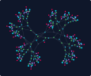
</div>
<p class="figure-caption">
  <strong>Brent–Kung Parallel Prefix Adder (32-bit).</strong> 
  Signals propagate through a binary prefix tree topology, computing carry-outs for wide blocks in logarithmic depth <i>O(log N)</i> instead of linear time.
</p>

I'm leaving the implementation of other adders from the PPA family as an exercise for the reader.

### Control and shift logic

Multiplexer trees and shifters are other essential building blocks in digital design, enabling data-driven routing and bit-field manipulation within execution pipelines. In MorphoHDL, we can express these structures using different recursive patterns.

#### Multiplexers
Multiplexer trees enable data-driven routing of information, such as selecting operation results based on instructions or fetching registers from a register file. 

The implementation below introduces a couple of new MorphoHDL constructs:

```python
# Two-input multiplexer standard cell
Mux2 = LUT(3, 0b1100_1010)  # x0, x1, sel -> sel ? x1 : x0 

@morpho(fallback=0)  # Return positional argument #0 (x) on fallback
def mux(x, sel):     # x: [M * 2^S], sel: [S] -> y: [M]
    rest, hi = HSLICE(sel, ONE)  # Slice a single high bit, or trigger fallback
    x0, x1 = SPLIT(x)
    y0 = mux(x0, rest)
    y1 = mux(x1, rest)
    y = Mux2(y0, y1, hi)
    return y
```

This code highlights two new language capabilities:

1. **Pass-through Fallback Shorthands**: 
   Hardware recursion base cases often simply return one of the input arguments unmodified (e.g., returning the remaining input bus when the select lines run out). Instead of writing boilerplate base-case functions, `fallback=N` specifies that when a cell encounters an out-of-bounds boundary, it automatically resolves to positional argument `N`. Here, `fallback=0` cleanly returns the remaining slice of `x` when `sel` is exhausted.

2. **`LSLICE` and `HSLICE` Primitives**:
   These primitives slice a segment of bits matching the width of a reference bus (`ref`) from either the low or high side of `x`, returning both the slice and the remainder. Crucially, if `x` contains fewer bits than `ref`, a boundary exception is triggered, naturally routing execution to the fallback module. (For instance, referencing `ONE` or `ZERO` has the exact same effect as slicing a 1-bit chunk).

A remarkable property of this recursive multiplexer implementation is that it naturally scales to select multi-bit words. When the input bus width `len(x)` is a multiple of the selection space 2<sup>len(sel)</sup>, the structure acts as a bus-wide multiplexer. For example, we can concatenate eight 32-bit words into a single 256-bit bus and route an entire 32-bit word using a 3-bit selector, without modifying the underlying code.

#### Logarithmic shifters
Another core building block in ALUs is the shifter, which executes logical/arithmetic shift instructions and extracts bit-fields. A classic logarithmic shifter (or barrel shifter) shifts an <i>N</i>-bit bus by a variable amount <i>s</i> using log<sub>2</sub>(<i>N</i>) cascading multiplexing stages. 

The implementation below dynamically generates this structure stage-by-stage:

```python
@morpho(fallback=0)
def right_shifter(x, s, pad):    # x: [N], s: [S], pad: [2^level] -> out: [N]
    _, x_rest = LSLICE(x, pad)       # Drop lower len(pad) bits
    _ = x_rest[0]                    # Stop recursion when x_rest is empty
    x_shifted = CAT(x_rest, pad)
    sel_bit, s_rest = LSLICE(s, ONE)
    y = Mux2(x, x_shifted, sel_bit)
    pad2 = CAT(pad, pad)     # Double shift size for next stage (2^(level+1))
    out = right_shifter(y, s_rest, pad2)
    return out
```

<div class="morpho-layout" data-key="shifter" data-node-size="0.8"
data-src="data/right_shifter_32x5x1_layout.json"
data-masks="data/right_shifter_32x5x1_mask.json" 
data-mask-colors="#ffa500">
  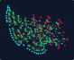
</div>
<p class="figure-caption">
  <strong>Logarithmic Barrel Shifter (32-bit).</strong> 
  <span style="color:#ffa500; font-weight:bold;">Orange</span> highlights the selection inputs and their fan-out trees.
</p>

Unlike the previous recursive structures (adders and multipliers) that perform explicit binary partitioning of the input operands, the shifter utilizes a linear tail-recursive structure. Width partitioning happens implicitly at each stage through the parallel instantiation of the two-input multiplexer (`Mux2`) across the bus width.

At stage <i>k</i>, the shifter slices the lowest bit of the select bus and conditionally shifts the intermediate bus by 2<sup><i>k</i></sup> positions. The recursion stops automatically when the shift amount exceeds the width of the input bus. At this point, the slice operation returns an empty remainder, and accessing its first element (`x_rest[0]`) triggers a boundary exception that activates the fallback pass-through.

Because the recursion depth is bounded by log<sub>2</sub>(<i>N</i>) for an <i>N</i>-bit bus, any extra select bits are never evaluated. Ignoring these high-order bits is the typical way shifts are implemented in modern CPUs (such as RISC-V, which only uses the lower log<sub>2</sub>(<i>N</i>) bits of the shift amount). Under this scheme, the compiler naturally detects and prunes the unused select lines during netlist optimization.

Additionally, the nature of the shift is determined entirely by the padding bit. Initializing the pad parameter with a 1-bit zero bus performs a logical right shift, while wiring the pad to the sign bit (the MSB of `x`) replicates it across the shifted-in positions to perform an arithmetic right shift.

Furthermore, to save silicon area, modern CPU execution units rarely implement separate physical circuits for left and right shifts. Instead, they reuse a single right shifter circuit for both directions by conditionally reversing the bit-order of the input bus before the shift, and reversing it back afterward. In MorphoHDL, bus reversal is written natively using standard Python `x[::-1]` slicing syntax.


### Recursive carry-save multiplier

Now that we have a reasonably efficient adder, let's build a *reasonably efficient* multiplier. The circuit described here is a **Recursive Carry-Save Multiplier**—a highly regular, hierarchical variant of the classic Wallace multiplier. This design allows us to demonstrate an incredibly important yet unsung technique in the world of high-performance computing and AI accelerators: **Carry-Save Addition**. Let's give AI a chance to briefly explain the importance of this circuit:

> **Why Carry-Save Addition Matters**
> 
> Adding two binary numbers requires propagating carries from right to left, which is the primary speed bottleneck in digital arithmetic. When summing many numbers (such as partial products in a multiplier), doing this sequentially with standard adders causes carry propagation at every step.
> 
> A **Carry-Save Adder (CSA)** breaks this bottleneck by computing sum and carry bits locally for each position. By running 1-bit full adders in parallel without any carry propagation, it reduces three input vectors to two outputs, <i>S</i> and <i>C</i> (satisfying <i>X + Y + Z = S + 2C</i>), in **constant <i>O(1)</i> time** regardless of bit-width.
> 
> In AI accelerators (GPUs/TPUs), matrix multiplication requires summing hundreds of partial products. By organizing CSAs into a tree (a Wallace tree), we can reduce these hundreds of operands down to just two vectors using logarithmic <i>O(log N)</i> stages of constant <i>O(1)</i> delay. Carry propagation is paid only once, at the very end, to merge the final two vectors. Without CSAs, modern deep learning hardware would be orders of magnitude slower and hotter.

Here is how we can implement a 3-to-2 Carry-Save Adder in MorphoHDL and combine two of them into a 4-to-2 reduction, which we will use in the recursion step.

```python
@morpho
def csa_3to2(a, b, c):          # a: [N], b: [N], c: [N] -> sum: [N], carry: [N]
    sum, carry = full_adder(a, b, c)
    c_shift = CAT(ZERO, carry[:-1])
    return sum, c_shift

@morpho
def csa_4to2(a, b, c, d):       # a: [N], b: [N], c: [N], d: [N] -> sum: [N], carry: [N]
    s1, c1 = csa_3to2(a, b, c)
    sum, carry = csa_3to2(s1, c1, d)
    return sum, carry
```

The code above demonstrates a few key language features. First, `full_adder` accepts multi-wire buses instead of individual single-bit signals; MorphoHDL assumes these buses share the same width and recursively divides them down to primitive single-bit operations in parallel. Second, `ZERO` and `ONE` represent single-bit buses containing the constant logic values `0` and `1`, respectively. Finally, `carry[:-1]` leverages Python's native list slicing syntax for bus manipulation. To prevent the usual confusion surrounding bit ordering, MorphoHDL buses are always indexed from the least-significant bit to the most-significant bit (`x[0]` = LSB, `x[-1]` = MSB).

Once we have the basic `csa_3to2` block, we can implement an arbitrary-width multiplier by recursively splitting the first operand, `a`. We retain the `wallace_` prefix in the code below because the carry-save reduction tree generated by the recursion is a hierarchical formulation of the classic Wallace tree [[5]](#references).

```python
# Base case 1: 1xN-bit multiplier.
# The product of a single bit a0 and a bus b is simply a bitwise AND.
@morpho
def wallace_base1(a0, b):        # a0: [1], b: [M] -> s: [M + 1], c: [M + 1]
    s = CAT(And(a0, b), ZERO)     # Expand by 1 bit for alignment headroom
    c = REPEAT(ZERO, s)
    return s, c

# Base case 2: 2xN-bit multiplier.
@morpho(fallback=wallace_base1)
def wallace_base2(a01, b):       # a01: [2], b: [M] -> s: [M + 2], c: [M + 2]
    a0, a1 = SPLIT(a01)
    s = CAT(And(a0, b), ZERO, ZERO)
    c = CAT(ZERO, And(a1, b), ZERO)   # Align upper product
    return s, c

# Recursively computes the Carry-Save representation of the product a * b.
# Output width invariant: len(s_out) == len(c_out) == len(a) + len(b)
@morpho(fallback=wallace_base2)
def wallace_rec(a, b):           # a: [N], b: [M] -> s: [N + M], c: [N + M]
    _ = a[2]                     # Fallback check: requires len(a) >= 3
    a0, a1 = SPLIT(a)
    s0, c0 = wallace_rec(a0, b)
    s1, c1 = wallace_rec(a1, b)
    z0 = REPEAT(ZERO, a0)
    z1 = REPEAT(ZERO, a1)
    s, c = csa_4to2(CAT(s0, z1), 
                    CAT(c0, z1), 
                    CAT(z0, s1),
                    CAT(z0, c1))
    return s, c

# Top-level multiplier. Resolves the carry-save form into the final binary sum.
@morpho
def wallace_multiplier(a, b):    # a: [N], b: [M] -> p: [N + M]
    sum_out, carry_out = wallace_rec(a, b)
    p, _ = brent_kung_adder(sum_out, carry_out, ZERO)
    return p
```

The code above defines two base cases and recursive logic which divides the multiplier `a` in half at each step, recursively computes the partial products in carry-save form, and then shifts and reduces them. Since the upper half's product `s1, c1` has a higher binary weight than the lower half's product `s0, c0`, the two pairs of vectors must be aligned before reduction. We achieve this by padding the lower products at the MSB side and the upper products at the LSB side, maintaining the output width invariant of `len(a) + len(b)`. Finally, we pass these four aligned vectors into `csa_4to2` to compress them back down into a single sum and carry pair.

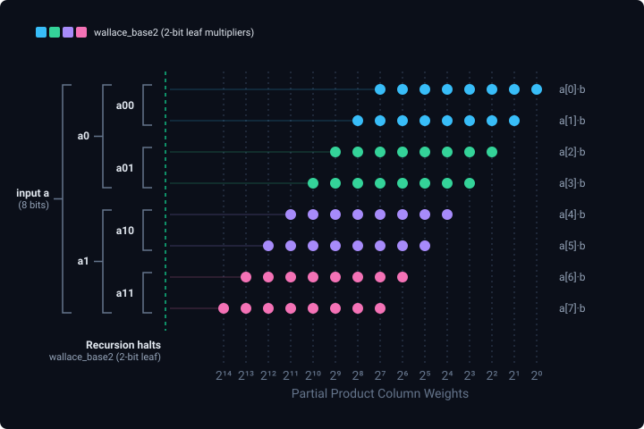
<div class="figure-caption">
  <strong>Recursive Carry-Save Multiplier (8x8).</strong> 
  A Wallace-like reduction tree constructed by recursively splitting operand <i>a</i> into smaller leaf multipliers and reducing partial product vectors with carry-save adders.
</div>

While it may seem suboptimal to instantiate full adders when some inputs are guaranteed to be zero, modern logic synthesis tools perform **constant propagation** and gate pruning, automatically simplifying the circuit to its minimal form. This has a beautiful parallel in developmental biology: during morphogenesis, organisms often overproduce cells and synaptic connections, relying on programmed pruning (such as apoptosis or synaptic pruning) to carve out the final, efficient structure.

Note, however, that this basic compile-time optimization cannot prune the bloated adder trees that would result from letting the recursion run all the way down to 1-bit leaves. This is why the 2-bit base case (`wallace_base2`) is introduced: it halts the recursion early for even-sized blocks, directly materializing the 2-bit partial products. Under this scheme, the 1-bit base case (`wallace_base1`) serves as a structural fallback only when partitioning non-power-of-two bus widths.

<div class="morpho-layout" data-key="wallace" data-src="data/wallace_multiplier_16x16_layout.json" data-color-by-depth="true" data-masks="data/wallace_multiplier_16x16_mask_brent_kung_adder.json,data/wallace_multiplier_16x16_mask_wallace_rec.json" data-mask-colors="#ffa500,#8b5cf6" data-show-resolved-bits="true">
  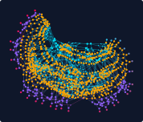
</div>
<div class="figure-caption">
  <strong>Recursive Wallace Multiplier (16x16-bit).</strong> 
  <span style="color:#ffa500; font-weight:bold;">Orange</span> highlights the Wallace 4-to-2 carry-save reduction tree levels; <span style="color:#8b5cf6; font-weight:bold;">purple</span> highlights the final Brent–Kung adder stage.
</div>


## From boolean circuits to Kunstformen

We have implemented several key combinational building blocks almost sufficient to construct a complete ALU for a simple RISC-V CPU, which was my initial objective. However, while developing the core language, I noticed that some resulting circuit graph layouts resemble the symmetric, organic creatures illustrated in Ernst Haeckel's classic *Kunstformen der Natur* (Art Forms in Nature) [[7]](#references). This realization prompted me to push the language further: treating MorphoHDL not just as a compiler for digital logic, but as a general engine for generative graph topology, where logic gates serve as physical building blocks for organic structures.

### Tail recursion growth

We already saw linear tail recursion in action with the barrel shifter. Let's explore how tail recursion shapes physical graph layouts when applied to simpler geometries. Consider the code below:

```python
@morpho(fallback=0)
def triangle(x): # x: [N]
    y = Xor(x[1:], x[:-1])  # apply Xor to adjacent input bit pairs
    z = Not(y)   # y, z: [N-1]
    return triangle(z)
```

The code above grows a triangle graph row-by-row using Y-shapes produced by a combination of `Xor` and `Not` gates. In fact, any pair of binary and unary gates would have worked. Each subsequent row is one wire shorter than the previous, and the recursion stops when `len(x) == 1` because no new gate can be instantiated with empty inputs.

<div class="morpho-layout" data-key="triangle_bfs" data-src="data/triangle_32_layout.json" data-animate="false" data-node-size="2" data-color-by-depth="true">
  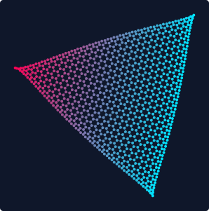
</div>
<div class="figure-caption">
  <strong>Growing triangle</strong> is created row-by-row using tail recursion.
  Colored by depth from <span style="color:#00e5ff; font-weight:bold;">inputs</span> to <span style="color:#ff0055; font-weight:bold;">outputs</span>.
</div>

This circuit serves as an interesting case illustrating the impact of the cell expansion schedule on layout topology. The layouts below show intermediate growth stages under Breadth-First Search (BFS) and Largest-First schedules. Click on either image to animate the growth process.

<div style="display: flex; gap: 16px; margin: 1.5em 0;">
    <div class="morpho-layout" data-key="triangle_bfs" data-src="data/triangle_32_layout_bfs.json" data-animate="false" data-node-size="2" data-color-by-depth="true" style="flex: 1; height: 320px; margin: 0;">
      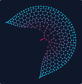
    </div>
    <div class="morpho-layout" data-key="triangle_largest" data-src="data/triangle_32_layout_largest.json" data-animate="false" data-node-size="2" data-color-by-depth="true" style="flex: 1; height: 320px; margin: 0;">
      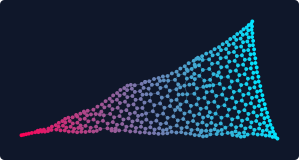
    </div>
</div>
<div class="figure-caption">
  <strong>Intermediate layout topologies</strong> generated using different subcell expansion schedules: 
  <em>Left:</em> Breadth-First Search (BFS) schedule, where tail recursion creates a localized growth zone at the tip of the triangle. 
  <em>Right:</em> Largest-First schedule, which produces uniform growth across the entire triangle.
</div>

### 2D Grid and Cell Substitution

Now, let's generate a regular rectangular grid using binary recursion instead of linear tail-recursion. Grid structures play a crucial role in modern hardware design—most notably as the systolic arrays that act as the workhorses of modern AI accelerators. The code below demonstrates how to achieve recursive splitting along two axes using a single cell definition that swaps its input buses to alternate the split direction at each level of recursion.

```python
# Base case: Placed at the intersection of single-wire inputs
@morpho
def grid_base(x, y):
    z = Xor(x, y)
    return z, z

# Recursive step: Splits x-bus to divide the grid along one axis.
# By calling grid(y, x0), it swaps the axes to recursively divide the other dimension.
@morpho
def grid_split(x, y):
    x0, x1 = SPLIT(x)               # Split one dimension into halves
    y_mid, x0_out = grid(y, x0)     # Route y through first half (swapping axes)
    y_out, x1_out = grid(y_mid, x1) # Route y_mid through second half
    x_out = CAT(x0_out, x1_out)     # Recombine the split axis
    return x_out, y_out

# 1D Fallback: Called when the x-axis can no longer be split.
# Swaps inputs so grid_split can divide the remaining y-axis.
@morpho(fallback=grid_base)
def grid_1d(x, y):
    y_out, x_out = grid_split(y, x) # Swap to split the other axis
    return x_out, y_out
```

While experimenting with growing grids, I realized it would be useful to alter the base case or other aspects of the structure without duplicating the entire recursive call chain. Typically, such capabilities are associated with functional programming or template systems. To support this in MorphoHDL, I introduced a **cell substitution** mechanism, utilizing Python's keyword argument syntax. For instance, we can customize the grid by replacing the default base gate allele with a simple pass-through function (`base_skip`) passed as the `grid_base` parameter:

```python
@morpho
def base_skip(x, y):
    return x, y

@morpho
def grid_skip(x, y):
    x_out, y_out = grid(x, y, grid_base=base_skip)
    return x_out, y_out
```

We can compare the physical layouts of both configurations side-by-side below. In the collapsing version (right), the compiler's LUT optimization pass simplifies the pass-through intersections, pruning the unused routing paths and leaving only isolated segments (click to animate):

<div style="display: flex; gap: 16px; margin: 1.5em 0;">
    <div class="morpho-layout" data-key="grid2d" data-src="data/grid_10x15_layout.json" data-animate="false" data-color-by-depth="true" style="flex: 1; height: 320px; margin: 0;">
      
    </div>
    <div class="morpho-layout" data-key="grid_skip" data-src="data/grid_skip_16x16_layout.json" data-animate="false" data-color-by-depth="true" style="flex: 1; height: 320px; margin: 0;">
      
    </div>
</div>
<div class="figure-caption">
  <strong>2D Grid layouts.</strong> 
  A side-by-side comparison of physical layouts generated by different base cases: 
  <em>Left:</em> A standard 10x15 Grid with XOR gates at every intersection, creating a regular 2D mesh. 
  <em>Right:</em> A collapsing 16x16 Grid where intersection gates are replaced by a pass-through connection (`base_skip`), leaving the unused internal wires to be optimized away by the compiler.
</div>

### Tubes, chains and trees

To build more complex, organic shapes, we can compose multiple recursive sub-circuits together. Below, we define four individual topological elements—**Ring**, **Tube**, **Chain**, and **Tree**—that serve as the modular building blocks for composing complex branching networks:

```python
# Connects adjacent bits and closes the loop to form a ring
@morpho
def ring(x):
    return And(x, CAT(x[1:], x[0]))

# Recursively cascades rings to grow a cylindrical mesh (tube)
@morpho(fallback=0)
def tube(x, n):
    n0, n1 = SPLIT(n)
    y = tube(x, n0)                  # Grow first half of the tube
    z = ring(y)                      # Close intermediate ring connections
    return tube(z, n1)               # Grow second half of the tube

# Recursively grows parallel linear chains of Not-gates
@morpho(fallback=0)
def chain(x, n):
    n0, n1 = SPLIT(n)
    return chain(Not(chain(x, n0)), n1)

# Hierarchical branching tree: grows a tube, splits it, and branches recursively
@morpho(fallback=chain)
def tree(x, n):
    y = tube(x, n)                   # Grow a cylindrical segment
    y0, y1 = SPLIT(y)                # Split the outputs to branch
    return CAT(tree(y0, n), tree(y1, n)) # Recursively grow branches and recombine
```

<div style="display: flex; flex-direction: column; gap: 16px; margin: 1.5em 0;">
    <div style="display: flex; gap: 16px;">
        <div class="morpho-layout" data-key="ring" data-src="data/ring_20_layout.json" data-animate="false" data-color-by-depth="true" style="flex: 1; height: 260px; margin: 0;">
          
        </div>
        <div class="morpho-layout" data-key="tube" data-src="data/tube_10x15_layout.json" data-animate="false" data-color-by-depth="true" style="flex: 1; height: 260px; margin: 0;">
          
        </div>
    </div>
    <div style="display: flex; gap: 16px;">
        <div class="morpho-layout" data-key="chain" data-src="data/chain_20x20_layout.json" data-animate="false" data-color-by-depth="true" style="flex: 1; height: 260px; margin: 0;">
          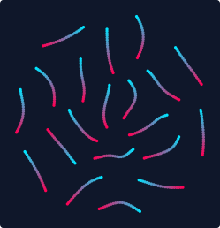
        </div>
        <div class="morpho-layout" data-key="tree" data-src="data/tree_10x15_layout.json" data-animate="false" data-color-by-depth="true" style="flex: 1; height: 260px; margin: 0;">
          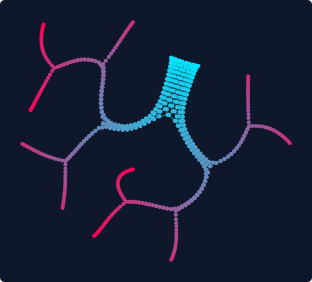
        </div>
    </div>
</div>
<div class="figure-caption">
  <strong>Ring, Tube, Chains, and Tree topologies.</strong> 
  Individual topological building blocks that are combined hierarchically to construct complex composite layouts: 
  <em>Top-Left:</em> A Ring closing into a circular loop. 
  <em>Top-Right:</em> A cylindrical Grid (Tube), showing regular loop-closures folded into a tube geometry. 
  <em>Bottom-Left:</em> Parallel logic gate Chains. 
  <em>Bottom-Right:</em> A Hierarchical Tree, displaying a branching network of nested divisions.
</div>

Finally, we can cascade these individual building blocks into a single compound layout. By connecting them in series, we generate a highly symmetric, organic structure resembling a medusa:

```python
@morpho
def medusa_half(x, n):
    x = tree(x, n)
    x = tube(x, n)
    x = chain(x, n)
    return x

@morpho
def medusa(x, n):
    a = medusa_half(x, n)
    b = medusa_half(x, n)
    return a, b
```

<div class="morpho-layout" data-key="medusa" data-src="data/medusa_36x8_layout.json" data-animate="false" data-node-size="2" data-color-by-depth="true">
  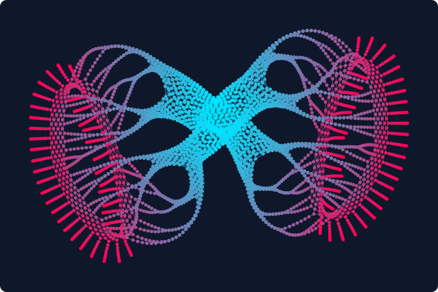
</div>
<div class="figure-caption">
  <strong>The Medusa compound structure.</strong> 
  A massive, high-density combination of trees, tubes, and chains. The physical layout reveals a beautifully symmetric, organic pattern resembling Haeckel's drawings of marine organisms.
</div>


## Implementation and compilation details

### Interpreting MorphoHDL programs

There are a few ways we can interpret MorphoHDL programs:

* **Imperative execution:** They can be read and executed as simple imperative programs that take bit lists as inputs and process them with recursive function calls. Recursion is stopped by primitives throwing exceptions, which are caught by fallback wrappers (see [CircuitRunner](tiny_morpho.py#L292) in [tiny_morpho.py](tiny_morpho.py)).

* **Traced execution:** Alternatively, we can run an imperative program but record all executed LUT operations into a dataflow graph. This opens up the possibility for circuit optimization through constant propagation and dead code elimination (DCE) (see [CircuitCompiler](tiny_morpho.py#L344) in [tiny_morpho.py](tiny_morpho.py)).

* **Graph rewrites:** Finally, we can view each individual `@morpho` function as a small graph where nodes (cells) have named and indexed input/output ports. A function call then represents a local rewrite, replacing a cell with its corresponding subgraph with inputs and outputs properly routed. Constant propagation and DCE are also local rewrite operations run between node expansions.

The graph rewrite framing of circuit construction gives us a choice in node expansion ordering. Traced execution corresponds to depth-first ordering. Breadth-first is another natural option. We can also precompute estimates of final expansion sizes (ignoring optimization) for all cells given their input bus sizes, and use this information for a greedy, "largest final size" expansion order, which tries to grow all parts of the graph uniformly. The final growth result is order-independent, but the order matters for aesthetic reasons, or if we couple circuit construction with a graph layout or a circuit place-and-route algorithm.

### On-the-fly materialization and progressive growth

In MorphoHDL, cells dynamically infer their bus widths at instantiation instead of relying on static upfront declarations. This flexibility introduces a chicken-and-egg problem during compilation. To connect a child module to other components, the compiler needs to know how many output wires it produces. However, those outputs can only be determined by recursively compiling the child's own sub-circuits.

The Morpho compiler (implemented in [compiler.js](js/compiler.js)) resolves this by compiling components on demand (or *materializing* them). When compiling a parent cell, the moment it encounters a child cell, it pauses the parent's wiring, resolves the child's concrete input widths, and immediately compiles a tailored version of the child for those inputs. Once compiled, the child's output widths become known, allowing the parent to allocate the correct number of wires and resume compilation. To avoid redundant compilation runs, these input-size-specific cell materializations are cached in a compilation registry. If another part of the circuit instantiates the same module with the same input dimensions, the compiler retrieves the cached definition.

The diagram below shows the resulting dependency graph of materialized cells generated during the compilation of the 16x16 Wallace multiplier. Nodes represent concrete, size-specific module instantiations, while arrows represent compilation dependencies (parent-to-child cell instantiations).

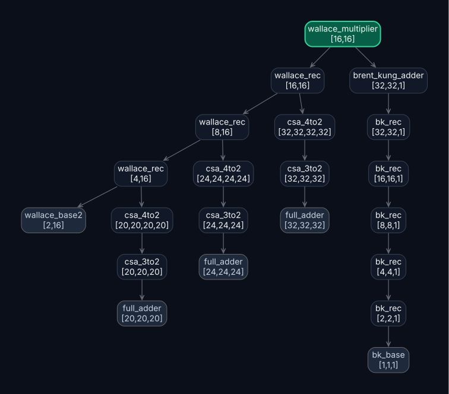
<div class="figure-caption">
  <strong>Wallace Multiplier Cell Dependency Graph.</strong> 
  The compilation hierarchy of concrete, size-specific cell materializations generated for a 16x16-bit Wallace multiplier. Each node denotes a module instance along with its resolved input bus widths, and arrows indicate parent-to-child compilation dependencies.
</div>

### Circuit optimization and buffer insertions

In digital electronics, a single logic gate output cannot drive an infinite number of destination inputs without slowing down or degrading the signal. This electrical loading limit is known as **fanout**. In a physical graph layout, high-fanout nets (like a global reset or a shared clock) also create a visual mess, pulling dozens of destination nodes into a tight, overlapping bundle at the center of the screen.

To solve this, the Morpho compiler enforces a maximum fanout limit (configured to 4 in our interactive viewer). If a net exceeds this threshold, the compiler splits the destinations into smaller groups and inserts **Buffer (`BUF`) cells** to act as intermediate repeater stations. In the layout engine, these buffers distribute the physical tension of the connections, allowing the nodes to naturally spread out into clean, branching trees instead of a cluttered web.

Alongside buffer insertion, the compiler continuously runs optimization passes to keep the circuit clean as it grows:
* **Constant Propagation:** If a gate's inputs simplify to static constants (0 or 1), the compiler evaluates the logic gate at compile-time and propagates the constant value downstream.
* **Dead Code Elimination (DCE):** If any cell or buffer's output is disconnected (its fanout falls to 0), the compiler prunes it from the netlist to avoid wasting logic resources.


## Conclusion and future directions

This article introduces MorphoHDL, a minimalistic framework for constructing boolean circuits and general graphs. While working on this article, I was frequently surprised by the capabilities of such a simple system. The language served as a playground and a tool for thought; for instance, I iterated on the fast carry-propagation adder multiple times, exploring different axes of division, before realizing a smooth and natural transition from the standard ripple-carry design.

The accompanying compiler implementations should be treated as experimental sketches rather than reference compilers. They omit many corner cases, are designed primarily to run the examples presented in this article, and even lack circuit export capabilities. While hardening and expanding this toolchain is an obvious avenue for future development, the core principles of MorphoHDL are simple enough to be implemented from scratch in almost any general-purpose language for application-specific use cases. Other potential research directions are discussed below.

### Recurrent circuits

So far, we have only discussed combinational (feed-forward) circuits. Naturally, a practical HDL must also provide a mechanism to express sequential logic, recurrent connectivity, and feedback loops. Below, we explore two competing design paradigms for expressing recurrent structures in MorphoHDL, and then sketch how genuinely stateful circuits could be built on top of them. To be clear, none of these mechanisms are implemented in the accompanying tools yet; what follows is a design discussion.

#### 1. Implicit feedback via forward references

Potentially, feedback can be naturally modeled by allowing variables to be referenced before definition, establishing cycles in the dataflow graph. Interestingly, this capability also enables new, highly expressive ways to define certain combinational circuits (such as a ripple-carry chain without explicit recursion):

```python
@morpho
def ripple_adder_rec(a, b, c_in):
    # create parallel full adders (c_prev is defined later)
    sum, carry = full_adder(a, b, c_prev)
    c_prev = CAT(c_in, carry[:-1])  # shift carry to form a chain
    c_out = carry[-1]
    return sum, c_out
```

* **Advantages:** This approach is conceptually pure and highly general. It treats signals as relational equations in a declarative netlist rather than a sequence of imperative instructions, effectively blurring the distinction between input and output wires. Crucially, it requires no language syntax modifications or special keywords.
* **Trade-offs:** It cannot be executed using simple imperative or traced evaluation methods (as discussed in the [*Interpreting MorphoHDL programs*](#interpreting-morphohdl-programs) section). When `full_adder` is called, `c_prev` is still undefined. This requires the compiler to use graph-rewriting engines that support speculative module instantiation, allowing cells to be created before their input bus widths are known.

#### 2. Explicit feedback via forward wire declarations

A more practical, though less conceptually declarative alternative introduces explicit forward declarations for cyclic wires (similar to wire declarations in standard HDLs):

```python
@morpho
def ripple_adder_rec(a, b, c_in):
    c_prev = empty_like(a)   # forward c_prev wire declaration
    sum, carry = full_adder(a, b, c_prev)
    c_prev.set(CAT(c_in, carry[:-1]))  # assign the wire values
    c_out = carry[-1]
    return sum, c_out
```

* **Advantages:** This design is significantly easier to implement in compiler backends and fits naturally into imperative and traced execution workflows. It also mirrors the explicit wire declaration patterns found in conventional hardware description languages (such as Verilog and SystemVerilog), making it familiar to hardware engineers.
* **Trade-offs:** It is less mathematically general and introduces state-mutation primitives (`empty_like` and `.set()`), moving away from MorphoHDL's minimalist, purely functional ideal.

#### From cycles to state

An attentive reader may have noticed that the "cycle" in `ripple_adder_rec` is an illusion: the definition is circular at the bus level, but the shift `CAT(c_in, carry[:-1])` makes each wire depend only on lower-order carries, so the bit-blasted graph is an ordinary feed-forward chain. Cycles that dissolve at the wire level are simply an expressive way to write combinational circuits; cycles that survive are where state lives. A surviving cycle can be given *synchronous* semantics (every cycle must pass through a register primitive `REG`, the standard HDL contract) or *asynchronous* semantics (raw feedback under fixed-point evaluation) — in which case state needs no new primitives at all:

```python
Nor = LUT(2, 0b0001)

@morpho
def sr_latch(s, r):
    q  = Nor(r, qn)   # forward reference: a true wire-level cycle
    qn = Nor(s, q)
    return q, qn
```

Two cross-coupled LUTs store a bit, and the textbook chain (gated D latch, master–slave flip-flop) then builds `REG` itself out of nothing but LUTs — the register is an abstraction convenience, not a language extension. Given one, the familiar ripple adder acquires a temporal twin:

```python
@morpho
def serial_adder(a_bit, b_bit, c_in):
    c = REG(carry, c_in)   # carry delayed by one clock cycle, c_in at t=0
    sum, carry = full_adder(a_bit, b_bit, c)
    return sum
```

Operands are streamed one bit per clock cycle through a single `full_adder` — the very cell this article started with. `CAT(c_in, carry[:-1])` shifts the carry in *space*; `REG(carry, c_in)` shifts it in *time*: the same recursion, either unrolled as N cells or run for N clock cycles, with the width parameter reborn as cycle count. The mandatory initial value doubles as the register's width declaration, so width inference never has to chase an unclosed cycle (`REG(next, init)` is the `empty_like`/`.set()` pair of the second paradigm plus a clock tick). Note that `REG` also quietly introduces two implicit global signals — the clock, and a reset that loads `init` — distributed like power rather than routed as wires; making them explicit (clock enables, multiple domains) is where this sketch would meet real sequential design.

Feedback composes with the article's bus idioms just as well — a register bus, two cyclic neighbor shifts, and one broadcast LUT make an elementary cellular automaton:

```python
Rule110 = LUT(3, 0b0110_1110)   # canonical Wolfram truth table

@morpho
def ca_row(init):
    state = REG(next, init)          # N-bit register bus, seeded by init
    l = CAT(state[1:], state[:1])    # cyclic left/right neighbor views
    r = CAT(state[-1:], state[:-1])
    next = Rule110(r, state, l)      # LSB-first ports spell the index 4l+2c+r
    return state
```

Rule 110 is Turing-complete: once feedback exists, the encoding describes not just functions but behaviors. And while the rings and tubes of [*Tubes, chains and trees*](#tubes-chains-and-trees) close their loops only geometrically (their dataflow stays feed-forward), an electrical closure is one forward reference away: `y = Not(chain(y, n))`, with an odd total inverter count, is the classic ring oscillator.

None of the above currently runs — the sketches assume forward references (or `.set()`), a `REG` primitive, and clocked or fixed-point simulation. But the path to sequential logic requires no new structural ideas: cycles already fit the graph representation, and a single delay primitive (or, asynchronously, none at all) completes the picture.

### Evolving functions and structures

Another promising direction is using a MorphoHDL-like representation as a genotype for evolutionary programming algorithms. In designing the language, I deliberately avoided deeply nested syntax in favor of a flat, three-level structure:

1. **Genome:** A collection of **Genes** (cell definitions).
2. **Gene:** A set of **Expressions**, which refer to and instantiate other genes within the context of the current cell.
3. **Expression:** A set of **binding points**, which establish wire connectivity between the parent and child cell contexts.

As demonstrated by the examples in this article, the proposed language enables compact, input-size-agnostic descriptions of common and useful circuits. This structural conciseness gives reason to hope that artificial evolution might discover novel architectures within reasonable computational budgets.

Furthermore, physical building primitives like connective tissues, sensors, and actuators can be introduced into the language, potentially enabling a unified representation of robotic body plans and control circuitry. At the other end of the abstraction spectrum, introducing data-blob nodes—exposing wide buses that can be multiplexed into random-access memory—could enable circuit-microcode co-evolution. This co-evolutionary process could be bootstrapped by seeding the initial genome with known useful circuits, such as those explored in this article.

Finally, the developmental nature of recursive circuit synthesis opens a path toward unifying synthesis with placement and routing, enabling faster turnaround times and novel physical optimizations.


## Acknowledgements

I am grateful to Blaise Agüera y Arcas and the Paradigms of Intelligence team for supporting this work. Special thanks to Eyvind Niklasson, Ehsan Pajouheshgar and Pietro Miotti for their valuable feedback on early drafts of this article.


## AI use disclosure

The core language design ideas and the immediate-mode reference implementation (`tiny_morpho.py:CircuitRunner`) were 100% human-authored. While AI agents were used to iterate on some circuit designs, the most significant advances were made by the author. In particular, the agents I used often preferred overcomplicated designs and were sluggish to find shortcuts, which I tentatively interpret as a sign of the work's originality.

Optimizing `CircuitCompiler` is about 80% human-written, with all AI contributions carefully reviewed. `compiler.js`, the key progressive graph rewrite engine, was mostly written by an AI agent under very close human guidance and supervision. The graph layout engine code is about 50% human-written, with closely supervised AI contributions. The <a href="https://swiss.gl/">SwissGL</a> library used for rendering was created by the author in pre-AI times, but the LLM agent was surprisingly good at picking up the library's best practices (did <a href="https://github.com/paradigms-of-intelligence/swissgl">the repo</a> make it into the training data?). The rest of the UI code and tests were "vibe-coded" with approximately 30% code "eyeball coverage."

The first version of almost every paragraph in this article was author-written, with a few subsequent passes of LLM-based refinements.


## References

1. **Lava (Functional HDL)**:
   Bjesse, P., Claessen, K., Sheeran, M., & Singh, S. (1998). [Lava: An embedded language for hardware description](https://dl.acm.org/doi/10.1145/291251.289440). *ACM SIGPLAN Notices*.

2. **CLaSH (Modern Functional HDL)**:
   Baaij, C., Kooijman, M., Kuper, J., de Vos, A., & Smits, G. (2010). [CLaSH: Structural functional hardware description](https://clash-lang.org/). *Proceedings of the 13th International Workshop on Digital System Design (DSD)*.

3. **Chisel (Scala-based HDL)**:
   Bachrach, J., Vo, H., Richards, B., Lee, Y., Waterman, A., Avizienis, R., Ou, A., & Asanović, K. (2012). [Chisel: constructing hardware in a Scala embedded language](https://www.chisel-lang.org/). *DAC Design Automation Conference*.

4. **Brent–Kung Prefix Adder**:
   Brent, R. P., & Kung, H. T. (1982). [A regular layout for parallel adders](https://ieeexplore.ieee.org/document/1675982). *IEEE Transactions on Computers*.

5. **Wallace Multiplier**:
   Wallace, C. S. (1964). [A suggestion for a fast multiplier](https://doi.org/10.1109/PGEC.1964.263830). *IEEE Transactions on Electronic Computers*.

6. **L-Systems (Algorithmic Modeling)**:
   Prusinkiewicz, P., & Lindenmayer, A. (1990). [*The Algorithmic Beauty of Plants*](https://algorithmicbotany.org/papers/#abop). Springer-Verlag.

7. **Art Forms in Nature (Generative Design inspiration)**:
   Haeckel, E. (1904). [*Kunstformen der Natur*](https://en.wikipedia.org/wiki/Kunstformen_der_Natur).